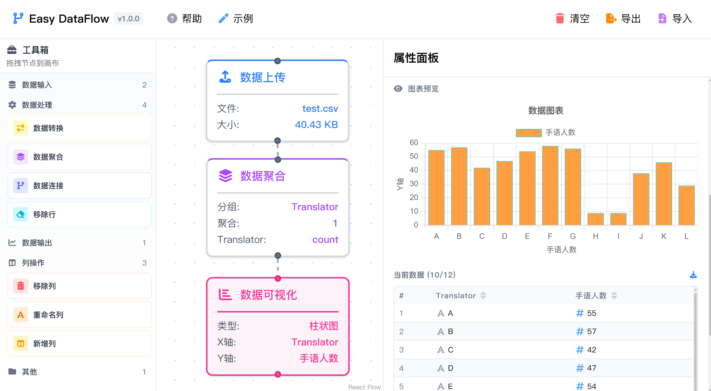

# Easy DataFlow

<div align="center">
  
  
  <p><strong>可视化数据处理工具 - 无需编码</strong></p>
  
  <p>
    中文 | <a href="README.md">English</a>
  </p>
</div>

## 功能介绍

Easy DataFlow 通过可视化工作流转换 CSV 数据。连接处理节点来清理、转换、聚合和可视化您的数据，无需编写代码。

**核心操作：**
- **数据输入**：上传 CSV 文件，手动添加行
- **列操作**：重命名、添加或删除列  
- **行操作**：根据条件过滤、转换或添加行
- **数据处理**：聚合、连接数据集、应用转换
- **可视化**：生成图表（柱状图、折线图、饼图、散点图、直方图）
- **工作流管理**：保存、加载和分享处理工作流

## 快速开始

```bash
npm install
npm run dev
```

访问 `http://localhost:5173` 开始处理数据。

## 构建

```bash
npm run build
```

## 项目结构

```
src/
├── components/     # React 组件
├── processors/     # 数据转换逻辑
├── stores/        # 状态管理
├── themes/        # UI 主题和样式
├── types/         # TypeScript 定义
└── utils/         # 工具函数
```

## 贡献

如果你有任何问题，你可以 🐛 [提交 Issue](https://github.com/TuGuobin/easy-dataflow/issues) | 🔧 [贡献代码](https://github.com/TuGuobin/easy-dataflow/pulls)。

## 许可证

MIT 许可证 - 详见 [LICENSE](LICENSE) 文件。