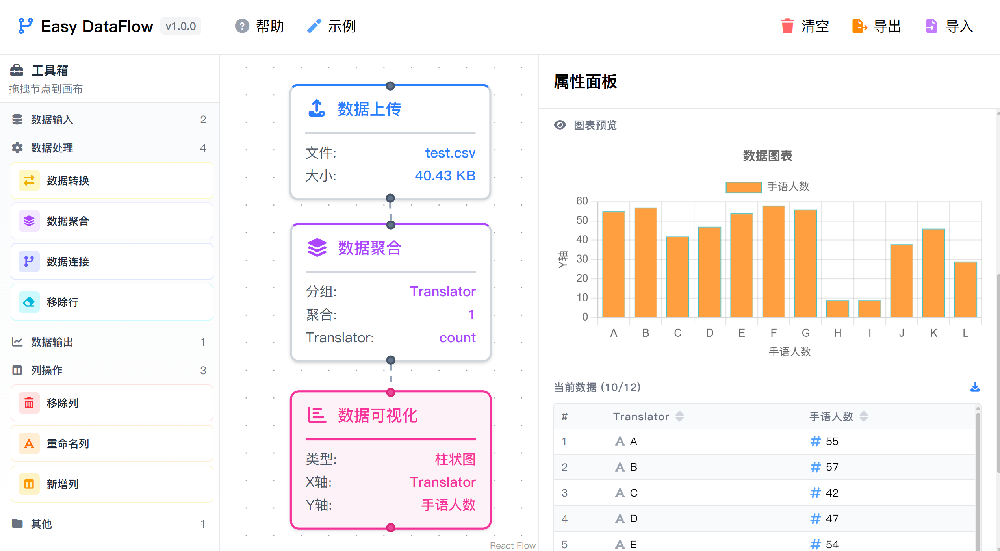

# Easy DataFlow

<div align="center">
  
  
  <p><strong>Visual data processing tool - no coding required</strong></p>
  
  <p>
    <a href="README-zh.md">中文</a> | English
  </p>
</div>

## What it does

Easy DataFlow transforms CSV data through visual workflows. Connect processing nodes to clean, transform, aggregate, and visualize your data without writing code.

**Core operations:**
- **Data Input**: Upload CSV files, add rows manually
- **Column Operations**: Rename, add, or remove columns  
- **Row Operations**: Filter, transform, or add rows based on conditions
- **Data Processing**: Aggregate, join datasets, apply transformations
- **Visualization**: Generate charts (bar, line, pie, scatter, histogram)
- **Workflow Management**: Save, load, and share processing workflows

## Quick Start

```bash
npm install
npm run dev
```

Visit `http://localhost:5173` and start processing data.

## Build

```bash
npm run build
```

## Project Structure

```
src/
├── components/     # React components for UI
├── processors/     # Data transformation logic
├── stores/        # State management
├── themes/        # UI themes and styling
├── types/         # TypeScript definitions
└── utils/         # Utility functions
```

## TODOs

- [ ] Add more data processing nodes
- [ ] Multi-file batch processing
- [ ] Light/dark mode toggle
- [ ] More chart visualizations
- [ ] Performance optimization
- [ ] Documentation

## Contributing

If you have any questions, you can 🐛 [Submit issues](https://github.com/TuGuobin/easy-dataflow/issues) | 🔧 [Contribute](https://github.com/TuGuobin/easy-dataflow/pulls).

## License

MIT License - see [LICENSE](LICENSE) file.
